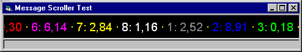



## Message Scroller Control \(Text Marquee\)

### Description

What? Another marquee? Yep. Put into 1 class and 1 usercontrol file. Can contain separate text "blocks" each with it own forecolor. Use the mouse to drag the display from left to right (or right to left) during the scrolling (just in case you missed out something that scrolled away). Continuous scrolling (does NOT wait if the last block is out of view, then start the first block, BUT glues the first block to the last one, so you see no break). Can place separator between blocks. It looks like the BBC News ticker. Click event on each text "block", scroll speed, colours, font, etc. Just download and see for yourself. Need more convincing? Someone quoted this is the best marquee on PSC yet....
 
### More Info
 
Text ofcause.

Include these files in your project and use the control. Or create your own OCX of it.

Nice scrolling marquee.

None known. But code can be improved (does not have to).

             |
---                |---
**Submitted On**   |2000-01-06 17:24:04
**By**             |[Tony](https://github.com/Planet-Source-Code/PSCIndex/blob/master/ByAuthor/tony.md)
**Level**          |Advanced
**User Rating**    |5.0 (50 globes from 10 users)
**Compatibility**  |VB 5\.0, VB 6\.0
**Category**       |[Custom Controls/ Forms/  Menus](https://github.com/Planet-Source-Code/PSCIndex/blob/master/ByCategory/custom-controls-forms-menus__1-4.md)
**World**          |[Visual Basic](https://github.com/Planet-Source-Code/PSCIndex/blob/master/ByWorld/visual-basic.md)
**Archive File**   |[CODE\_UPLOAD2744162000\.zip](https://github.com/Planet-Source-Code/tony-message-scroller-control-text-marquee__1-5337/archive/master.zip)

